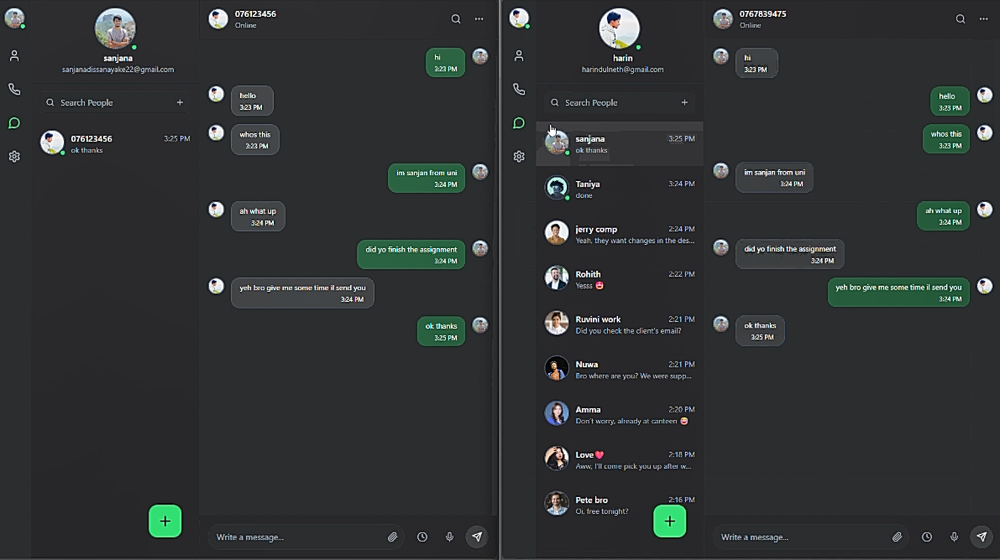

# Whisper — Full-Stack Secure Messaging App  

🚀 **Whisper** is a modern **full-stack secure web chat application** designed for people who want to **share their thoughts and messages privately** in a responsive and user-friendly way.  

---

## 🔑 Key Features  
- 🔒 Secure authentication & OTP-based registration (**JWT-protected routes**)  
- 📧 **SMTP Gmail service** for sending OTPs during login & registration  
- ⚡ Real-time chat with **WebSockets** for instant messaging  
- 👤 Profile management: avatar upload, status, notification & security settings  
- 🖼 **Cloudinary integration** for profile image uploads  
- ➕ Floating contact modal + quick-add contact UX  
- 🗄 PostgreSQL-backed persistence with migration/repair scripts  
- 🧩 Clean modular architecture with React Context API  

---

## 🛠 Tech Stack  

**Backend**  
- Java, Spring Boot, Maven  
- PostgreSQL  
- JWT for authentication  
- WebSockets for real-time communication  
- Gmail SMTP for OTP delivery  

**Frontend**  
- React, TypeScript, Vite  
- Tailwind CSS  
- React Context API for state management  

**Other Tools**  
- Cloudinary (media storage)  
- ESLint, PostCSS, Vite dev server  

---

## 💡 Why Whisper?  
Whisper makes it simple to **connect and communicate securely**, giving users a private space to share their thoughts while keeping the codebase **maintainable, scalable, and developer-friendly**.  

---

## 🚀 Getting Started  

### Prerequisites  
- Java 17+  
- Node.js 18+  
- PostgreSQL  

### Backend Setup  


## 📸 Screenshots  

### Login Page  
  

### Chat Interface  
  

```bash
cd whisper-backend
./mvnw spring-boot:run
